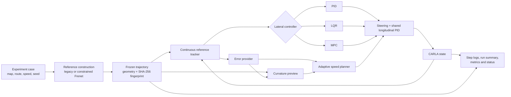

# Design and Evaluation of a CARLA-Based Path-Tracking Framework with Adaptive Speed Planning

This repository contains a Windows implementation of the traceable CARLA
path-tracking evaluation framework developed for the project of the same name.
It evaluates controller platforms and supporting optimisation modules under
recorded, matched simulation conditions.

The contribution is the **evaluation framework and evidence process**, not a
new PID, LQR, or MPC control law. The custom research layer is located in
[`PythonAPI/my_control_project`](PythonAPI/my_control_project/); CARLA provides
the simulator, maps, vehicle physics, actors, sensors, and standard actuation
interface.

## Documentation

- [Reproducibility record](docs/REPRODUCIBILITY.md) — runtime pins, commands,
  and the CARLA/runtime versus test-environment boundary.
- [Dissertation mapping](docs/DISSERTATION_MAPPING.md) — section-to-component
  index for the implementation and tests.
- [Third-party CARLA boundary](docs/THIRD_PARTY.md) — bundled infrastructure,
  provenance, and licensing scope.
- [Packaged CARLA README](docs/CARLA_PACKAGED_README.md) — original generic
  CARLA distribution instructions retained for provenance.

The repository keeps the bundled CARLA distribution because the current
reproduction path depends on it. The bundled server, maps, assets, physics,
actors, sensors, upstream Python API, and plugins remain third-party
components; see the boundary document above.

## Research scope

The framework addresses a practical problem in controller comparison: a result
cannot be attributed to a controller when the route, speed policy, reference,
error source, timing, or stopping rules also change. To make the comparison
traceable, the implementation:

- runs CARLA 0.9.14 in synchronous mode with a fixed 0.05 s control interval;
- constructs one reference trajectory before the controller laps, saves it,
  fingerprints its content, and checks the same in-memory reference before each
  matched run;
- evaluates PID, LQR, and MPC controller platforms through one experiment
  runtime and one vehicle-actuation interface;
- records the effective map, route, speed, seed, planner, error source,
  controller settings, stopping status, and evaluation metrics;
- supports matched optimisation-module ablation and comparison against CARLA's
  official PID implementation;
- provides adaptive target-speed planning and a replaceable tracking-error
  interface for controlled robustness studies.

## System overview



## Current implementation

### Controller platforms

| Platform | Current selected implementation |
| --- | --- |
| PID | CARLA-style look-ahead waypoint angular error, finite error buffer, derivative low-pass filtering, and bounded steering magnitude/rate. |
| LQR | Four-state dynamic bicycle formulation using lateral error, lateral-error rate, heading error, and heading-error rate, with discrete Riccati feedback and curvature preview conditioning. |
| MPC | Four-state dynamic bicycle prediction rebuilt at every control cycle, a 20-step horizon, curvature disturbance preview, and projected steering magnitude/rate limits. |

All three project controllers use the same longitudinal PID structure to turn a
fixed or planned target speed into mutually exclusive throttle or brake
commands. The repository also retains clearly separated baseline and recovered
implementations for controlled comparisons; they are not silently substituted
for the selected branches.

### Reference and route planning

- Route targets: `true_straight`, `straight`, `gentle_curve`, `s_curve`, and
  `curvy`.
- Map selection: automatic, current world, or an explicit supported Town map.
- Reference planners: `legacy` and constrained `frenet`.
- Reference conditioning: centreline resampling, smoothing, heading/curvature
  recomputation, lane-clearance checks, and continuous segment projection.
- Strict comparisons use `--planner-fallback error`; ordinary interactive runs
  may use the explicit `legacy` fallback for expected Frenet infeasibility or
  timeout conditions.

### Speed planning

`--speed-planner-mode off` holds the requested target speed for controller-only
tests. `--speed-planner-mode adaptive` forms candidate speed limits from:

- current and preview curvature;
- curve-entry curvature;
- lateral and heading error;
- lateral- and heading-error growth rate;
- recovery hold, hysteresis, and target acceleration/deceleration limits.

The lowest active candidate becomes the target speed, and its reason is logged
at each step. Use `--speed-planner-limit-profile global` when every controller
must share identical planner limits. The default `controller` profile is for
integrated system studies and is recorded explicitly.

### Error providers

- `ground_truth`: exact geometric errors from CARLA state and the frozen
  reference;
- `noisy_ground_truth`: configurable Gaussian noise, delay, held-sample
  dropout, and smoothing applied after geometric error calculation;
- `perception_proxy`: the same controlled perturbation implementation exposed
  through a perception-oriented label.

There is **no camera-, radar-, or LiDAR-derived tracking-error pipeline** in the
current code. The provider interface is the future integration boundary, not a
claim of completed perception.

## Requirements and setup

- Windows 11 or another compatible Windows environment
- the packaged CARLA 0.9.14 Windows build in this repository
- Miniconda or Anaconda with `conda` available
- a GPU and driver capable of running CARLA

Create or refresh the pinned `carla37` environment from the repository root:

```powershell
powershell -ExecutionPolicy Bypass -File .\PythonAPI\setup_carla37.ps1
```

The setup script installs Python 3.7, the packaged CARLA 0.9.14 wheel, NumPy,
SciPy, Matplotlib, NetworkX, Shapely, Pillow, and Pygame.

## Run a comparison

Start CARLA in one terminal:

```powershell
.\CarlaUE4.exe
```

Then run the project from a second terminal.

Fixed-speed, controller-only comparison:

```powershell
.\PythonAPI\my_control_project\scripts\run_my_control.ps1 `
  --speed-planner-mode off `
  --speed-planner-limit-profile global `
  --planner-mode frenet `
  --planner-fallback error `
  --target-speed 70 `
  --route-shape true_straight `
  --error-provider ground_truth `
  --controllers pid lqr mpc
```

Adaptive integrated-system run:

```powershell
.\PythonAPI\my_control_project\scripts\run_my_control.ps1 `
  --speed-planner-mode adaptive `
  --target-speed 90 `
  --route-shape s_curve `
  --map-name Town04_Opt `
  --seed 37321498 `
  --controllers pid lqr mpc
```

The default run requests the Frenet planner, permits the explicit legacy
fallback, uses adaptive speed planning with controller-specific limit profiles,
and runs `lqr`, `pid`, and `mpc`.

## Evaluation workflows

The project includes reusable workflows for:

- controller evaluation matrices and robustness perturbations:
  `scripts/run_controller_evaluation.ps1`;
- 90-case-per-variant module ablation:
  `scripts/run_internal_module_ablation_90.ps1`;
- legacy/Frenet smoke, extended, and stability matrices:
  `scripts/run_test_matrix.ps1`;
- aggregate metrics, paired comparisons, bootstrap intervals, Wilson intervals,
  report generation, and official-PID source/configuration audits in
  `experiment/`.

For a short planner smoke matrix:

```powershell
powershell -ExecutionPolicy Bypass -File `
  .\PythonAPI\my_control_project\scripts\run_test_matrix.ps1 `
  -ScenarioSet smoke -PlannerMode both
```

The matrix wrappers that own simulator startup launch CARLA when needed. Batch
workflows write manifests and status records and fail when required rows or
matched-condition checks do not pass.

## Outputs

Generated outputs are written below `PythonAPI/my_control_project/log/` and are
excluded from version control. A normal comparison run produces:

- `reference_trajectory.json` - saved reference geometry, metadata, and
  fingerprint;
- `step_log.csv` - per-step state, error, speed-plan reason, actuation,
  stability, and controller-time fields;
- `summary.csv` - run status and aggregate accuracy, speed, dynamics, runtime,
  and stability metrics;
- `run_config.json` - resolved experiment and implementation settings;
- `trajectory_compare.png` - route and controller trajectories;
- `human_summary.txt` - readable result and test-condition summary.

The primary evaluation logic treats completion and safety/stability conditions
as hard eligibility gates before softer accuracy, dynamics, and runtime metrics
are interpreted.

## Tests

Run the project test suite from the repository root with a Python 3.8+ development
environment containing the project dependencies:

```powershell
python -m unittest discover -s .\PythonAPI\my_control_project\tests -v
```

The suite covers configuration, controller construction, longitudinal control,
reference planning and tracking, error providers, speed planning, runtime and
termination, evaluation aggregation, official-PID comparison, and batch-script
contracts. CARLA execution remains pinned to the `carla37` environment because
of the packaged CARLA 0.9.14 wheel; the current tests use newer
`unittest.mock` call-inspection properties and should not be run under Python
3.7.

## Reported study evidence

The dissertation reports two primary evidence tracks produced with this
framework:

- 1,890 completed module-ablation runs evaluating 18 optimisation modules;
- 360 completed official-baseline runs, forming 270 matched
  official-to-candidate pairs with zero recorded condition mismatches.

For the recorded CARLA cases, the selected project PID gave the most balanced
overall result. Relative to CARLA's official PID, it reduced mean lateral IAE by
34.0%, speed RMS error by 15.5%, and lateral-jerk P95 by 27.3%, with similar
runtime. LQR reduced mean lateral IAE by 45.0% and speed RMS error by 15.4%, with
higher dynamic and computational demand. MPC reduced speed RMS error by 18.3%;
its wider metric profile was less consistently positive.

These are configuration- and scenario-specific simulation findings, not a
universal ranking of PID, LQR, and MPC. Adaptive-speed execution was verified,
but its independent benefit still requires a matched planner-off/planner-on
study. The work does not establish real-vehicle safety.

## Repository layout

```text
PythonAPI/my_control_project/
+-- run_my_control.py          # Main experiment entry point
+-- project_config.py          # Defaults, supported maps, and CLI options
+-- control/                   # PID, LQR, MPC, baselines, shared longitudinal PID
+-- road_planning/             # Route search, Frenet planning, reference tracking
+-- speed_planning/            # Curvature- and tracking-risk target-speed planner
+-- error_providers/           # Exact and controlled perturbed error sources
+-- experiment/                # Runtime, logging, metrics, aggregation, reports
+-- scripts/                   # Launchers, matrices, and module-ablation workflows
+-- tests/                     # Unit and regression tests
```

Detailed developer notes are available in
[`PythonAPI/my_control_project/README.md`](PythonAPI/my_control_project/README.md).

## 中文说明

本仓库实现了一个基于 CARLA 0.9.14 的可追溯路径跟踪评估框架。项目在固定的
0.05 秒同步循环中，对 PID、LQR 和 MPC 控制器平台及其优化模块进行匹配条件下的
比较。核心方法包括冻结并校验参考轨迹、统一实验配置和终止规则、模块消融、CARLA
官方 PID 外部基准、自适应目标速度规划，以及可替换的跟踪误差接口。

本项目的主要贡献是评估框架和证据流程，而不是新的控制理论。当前
`perception_proxy` 仅用于可控噪声、延迟、丢帧和平滑实验，并不包含真实视觉、雷达或
激光雷达感知。所有结论仅适用于已记录的 CARLA 仿真条件，不能用于证明实车安全。

## License

See [`LICENSE`](LICENSE) for the bundled CARLA/CVC provenance text. That file
does not settle an independent licence for the author research code; CARLA and
other bundled third-party components retain their respective licences.
